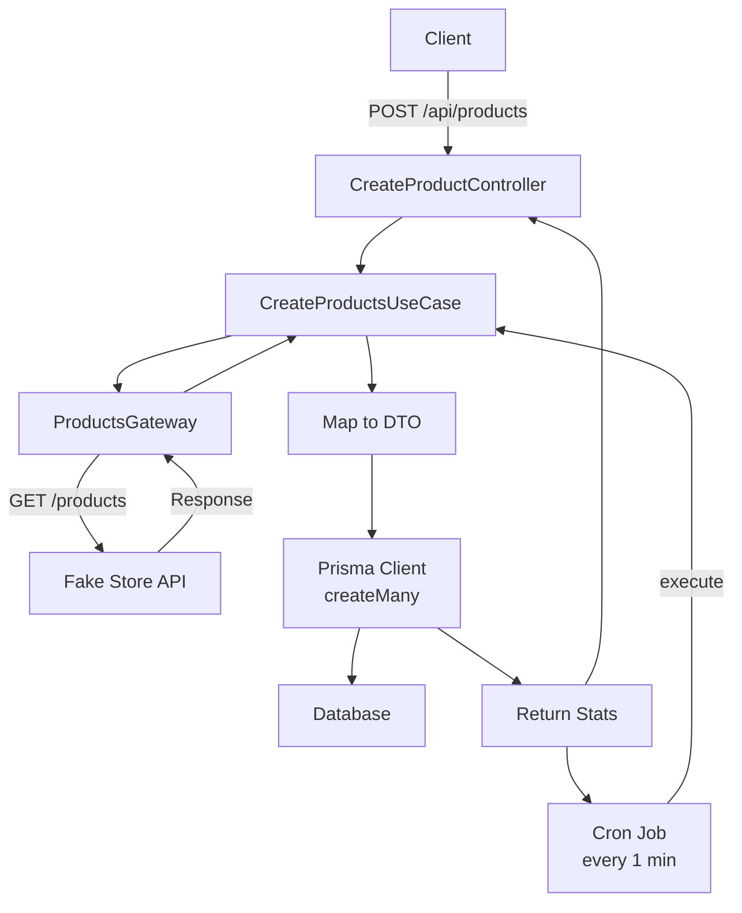

# ETL Products API

This is an ETL (Extract, Transform, Load) API that fetches products from the [Fake Store API](https://fakestoreapi.com/) and stores them in a PostgreSQL database using Prisma. The system includes a scheduled cron job that runs every minute to automatically fetch and insert new products, as well as a manual REST API endpoint to trigger the process on demand.

## Features

- **Automated ETL**: Cron job fetches products every minute.
- **Manual Trigger**: REST API endpoint to run ETL manually.
- **Duplicate Handling**: Skips inserting products that already exist based on `idFakeStoreProducts`.
- **Error Handling**: Global error handler with proper HTTP status codes.
- **Swagger Documentation**: API docs available at `/docs` when running.
- **Clean Architecture**: Organized with use cases, gateways, and controllers.

## Getting Started

### Prerequisites

- Node.js (v18+)
- pnpm
- PostgreSQL database

### Installation

1. Clone the repository:

   ```bash
   git clone <repo-url>
   cd etl-products
   ```

2. Install dependencies:

   ```bash
   pnpm install
   ```

3. Set up environment variables:
   - Copy `.env.example` to `.env` (if exists) or check `src/env.ts` for required variables.
   - Ensure `DATABASE_URL` points to your PostgreSQL instance.

4. Run database migrations:

   ```bash
   npx prisma migrate dev
   ```

5. Start the development server:
   ```bash
   pnpm dev
   ```

The server will run on `http://localhost:3000` (or as configured in env).

### API Documentation

Access Swagger UI at `http://localhost:3000/docs` for interactive API docs.

#### POST /api/products

Triggers the ETL process to fetch products from Fake Store API and insert them into the database.

**Request:**

- **Method:** POST
- **URL:** `/api/products`
- **Headers:** None required
- **Body:** None

**Response:**

- **201 Created** (Success)
  ```json
  {
    "success": true,
    "message": "Products saved successfully",
    "data": {
      "total": 20,
      "inserted": 15,
      "duplicates": 5
    },
    "timestamp": "2026-04-17T12:00:00.000Z"
  }
  ```
- **400 Bad Request** (Validation error)
- **502 Bad Gateway** (External API failure)

**Description:**

- Fetches all products from Fake Store API.
- Maps the data to match the Product model.
- Inserts into the database using `createMany` with `skipDuplicates: true`.
- Returns statistics on total fetched, inserted, and duplicates.

## Architecture

The project follows Clean Architecture principles, separating concerns into layers:

- **Infra**: HTTP, database, external gateways, jobs.
- **App**: Use cases, factories, errors.
- **Lib**: External API clients.

### ETL Flow Diagram



### Database Schema

The `Product` model in Prisma:

```prisma
model Product {
  id                  String   @id @default(uuid())
  idFakeStoreProducts Int     @unique @map("id_fake_store_products")
  title               String
  price               Float
  image               String
  createdAt           DateTime @default(now()) @map("created_at")
  updatedAt           DateTime @updatedAt @map("updated_at")

  @@map("products")
}
```

## Technologies Used

- **Fastify**: Web framework
- **Prisma**: ORM for PostgreSQL
- **Zod**: Schema validation
- **Axios**: HTTP client for external API
- **Node-cron**: Scheduled jobs
- **Swagger**: API documentation

## Scripts

- `pnpm dev`: Start development server with hot reload
- `npx prisma migrate dev`: Run database migrations
- `npx prisma studio`: Open Prisma Studio for database management

## Contributing

1. Follow the Clean Architecture structure.
2. Add tests for new features.
3. Update this README for API changes.
